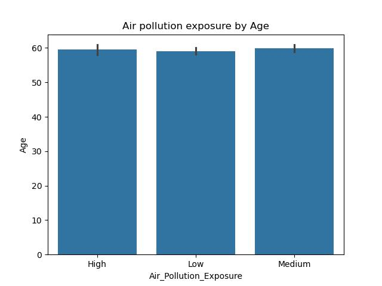

# 🩺 Lung Cancer EDA Analysis

This repository contains an Exploratory Data Analysis (EDA) on a lung cancer dataset. The project investigates the impact of age, gender, smoking behavior, second-hand smoke, air pollution, and geographic distribution on lung cancer mortality and 5-year survival rates.

---

## ✅ Key Analyses

1. **Country-wise Cancer Patient Count**  
   

2. **Gender distribution of lung cancer patients**  
   

3. **Mortality risk analysis based on Gender, Age and Smoking Status**  
   

4. **Age group with the highest lung cancer**  
   

5. **Heatmap of 5 year survival probability by country and age**  
   

6. **Analysis of Age , 5 year survival probability , gender , smoking status**  
   

7. **Analysis of age and Air pollution exposure**  
   

8. **Analysis on Socioeconomic_Status**  
   

9. **Second-hand Smoke Analysis**  
   

10. **Analysis on Age , Rural or Urban people, Healthcare Access and 5 Year Survival Probability of Bangladeshi Lung Cancer Patients**  
    

---

## 🧠 Insights

- Elderly and smokers are at significantly higher risk.
- Second-hand smoke and air pollution also reduce survival chances.
- Bangladesh follows global trends but shows lower early detection.

---

## 🛠️ Tools Used

- Python (Pandas, Matplotlib, Seaborn)
- Jupyter Notebook
- Markdown
- Git & GitHub

---
